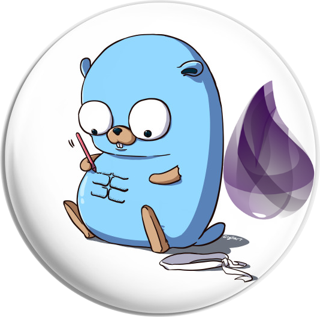

[![Contributors][contributors-shield]][contributors-url]
[![Forks][forks-shield]][forks-url]
[![Issues][issues-shield]][issues-url]
[![MIT License][license-shield]][license-url]

<!-- PROJECT LOGO -->
 

  

  <h3 align="center">Meetups</h3>

  

    Presentaciones de mi participación en meetups
     
     
    <a href="https://www.youtube.com/channel/UCabvfkjqAx73geQNcEZAQGA/featured">Elixir en Youtube</a>
    ·
    <a href="https://www.meetup.com/es/GophersMX/">Meetup de Golang</a>
  

<!-- LICENSE -->
## License

Distributed under the MIT License. See `LICENSE` for more information.

<!-- CONTACT -->
## Contacto

Iván Jaimes 

- [@iver14](https://twitter.com/iver14) 
- [Blog](https://iver.mx)

[contributors-shield]: https://img.shields.io/github/contributors/iver/meetups.svg?style=social
[contributors-url]: https://github.com/iver/meetups/graphs/contributors
[forks-shield]: https://img.shields.io/github/forks/iver/meetups.svg?style=social
[forks-url]: https://github.com/iver/meetups/network/members

[issues-shield]: https://img.shields.io/github/issues/iver/meetups.svg?style=social
[issues-url]: https://github.com/iver/meetups/issues

[license-shield]: https://img.shields.io/github/license/iver/meetups?style=social
[license-url]: https://github.com/iver/meetups/blob/master/LICENSE
